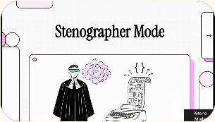

# Steno Mode


## Demo

[](https://akashai7.github.io/stenographer-mode/demo/video.html)

**Watch the demo:** click the thumbnail above to open the video.


Shorthand-first token compression that stays readable, technical, and structurally precise.

Steno Mode is a prompt product for compact technical responses. It compresses through stable shorthand, preserved literals, and scan-friendly structure so the output stays useful in real engineering workflows.

## Why This Exists

- Technical answers often waste tokens on filler, framing, and repeated setup.
- Raw shortening can save tokens but damage scanability and precision.
- Steno mode is built to keep causality, identifiers, commands, and code-adjacent clarity intact while staying compact.

## Why Steno

### The Problem

AI responses are expensive. Every token costs money, time, and attention. Most technical answers are 30-50% filler: soft phrasing, redundant transitions, and verbose setup that adds reading time without adding value.

### The Solution

Steno mode applies **structured compression** — not random shortening, but deliberate shorthand with rules that keep technical content intact.

| What steno preserves | Example |
| --- | --- |
| **Exact literals** | Commands, paths, error codes stay verbatim |
| **Causal chains** | `A -> B -> C` notation shows flow at a glance |
| **Code structure** | Identifiers, function names, config keys unchanged |
| **Scan-friendly layout** | Bullets, arrows, sections enable fast navigation |

### The Payoff

| Benefit | Impact |
| --- | --- |
| **~40% token reduction** | Lower API costs, faster responses |
| **Faster reading** | Scan in seconds instead of parsing paragraphs |
| **Better retention** | Dense info sticks; filler fades |
| **Technical accuracy** | No lossy compression on what matters |
| **Consistent style** | Predictable abbreviations across responses |

### Who Benefits Most

- **Senior engineers** who scan faster than they read
- **Code reviewers** who process many PRs per day
- **On-call responders** who need answers now, not essays
- **API-heavy workflows** where token costs add up
- **Documentation writers** who value density over decoration

### Real Numbers

From the benchmark corpus (50+ samples, 7 categories):

- **Baseline → Steno**: ~40% average token reduction
- **Caveman → Steno**: 86% win rate on readability-adjusted comparisons
- **Preserved precision**: 100% of code literals, paths, and error messages intact

Steno is not about saving tokens at any cost. It is about saving the right tokens while keeping everything that matters.

## Honest Scope

Steno mode is a specialized response style, not a universal improvement. It works well in some contexts and poorly in others.

### When steno helps

| Use case | Why it works |
| --- | --- |
| Code review comments | Concise feedback, technical literals preserved |
| Bug explanations | Causal chains stay clear with arrow notation |
| Architecture summaries | Flow descriptions compress well |
| API and config docs | Structured info maps to shorthand naturally |
| Debugging Q&A | Fast scan, exact errors and paths preserved |

### When steno hurts

| Use case | Why it fails |
| --- | --- |
| Onboarding and tutorials | Beginners need prose, not shorthand |
| Stakeholder communication | Executives expect full sentences |
| Ambiguous problem-solving | Nuance gets lost in compression |
| Empathetic responses | Human warmth requires words |
| Teaching new concepts | Analogies and explanations need space |

## How It Works

Steno mode is a **prompt instruction** that tells the AI to compress its responses using consistent rules. No ML models, no preprocessing — just a prompt that enforces formatting discipline.

The mode applies four compression tactics:

1. **Shorthand vocabulary** — Stable abbreviations like `cfg`, `auth`, `deps`, `req`, `resp`, `impl`, `ctx` that compress common technical words without losing meaning.

2. **Symbolic linking** — Arrow notation (`->`, `=>`) for causal chains, plus symbols (`w/`, `w/o`, `+`, `vs`) that compress connective phrases.

3. **Literal preservation** — Code snippets, file paths, commands, error messages, and identifiers stay **exactly as written**. No lossy compression on what matters.

4. **Structured layout** — Bullets, tables, and section breaks instead of dense paragraphs. Fast scanning over slow reading.

The result is output that looks like shorthand notes from a senior engineer — dense, precise, and scannable.

## Usage

### VS Code Copilot Chat

After installation, type `/steno` followed by your prompt:

```
/steno Why does this test fail intermittently?
```

Switch compression levels inline:

```
/steno lite  — tight professional prose
/steno brief — default shorthand (recommended)
/steno court — dense expert shorthand
/steno machine — maximum compression
```

### VS Code Agent Mode

Switch to the `Steno` custom agent from the agents picker, then ask normally:

```text
Review this diff for regressions.
```

Override the default level inline when needed:

```text
Use lite for this explanation.
Use court for terse progress updates.
```

Practical split:

- Ask mode: `/steno` prompt file for one-off compressed replies
- Agent mode: `Steno` custom agent for compressed progress updates, plans, findings, and final summaries

### Claude / ChatGPT / Cursor

Paste the contents of the appropriate pack into your system prompt or custom instructions:

| Platform | File |
|----------|------|
| Claude | `packs/claude/system.txt` |
| ChatGPT | `packs/chatgpt/custom-instructions.txt` |
| Cursor | `packs/cursor/rules.txt` |

Then use naturally — the AI will respond in steno style by default.

## Quick Comparison

Prompt: `Why does this API retry loop never stop?`

| Mode | Example | Tokens | Read on it |
| --- | --- | ---: | --- |
| Baseline | `The retry loop never stops because the retry counter is stored inside the request handler, so it resets to zero on every new attempt. Move the counter to state that survives across attempts.` | 52 | Clear, but long |
| Caveman | `Retry counter stored inside request handler. Each retry resets counter to zero. Terminal condition never hit. Move counter to state that survives retries.` | 27 | Fast, but rough |
| Steno | `Retry ctr lives inside req handler -> resets each attempt -> no terminal hit. Persist ctr across attempts.` | 20 | Compact and still technical |

Prompt: `Review this caching change.`

| Mode | Example |
| --- | --- |
| Baseline | `This change improves cache hit rate, but it also introduces a stale data risk because invalidation only occurs on create and not on update or delete.` |
| Caveman | `Cache hit rate better. Stale data risk. Invalidation only on create, not update/delete.` |
| Steno | `Hit rate up, but cache invalidation only covers create -> stale reads on update/delete paths.` |

Prompt: `Explain the architecture.`

| Mode | Example |
| --- | --- |
| Baseline | `The worker receives jobs from the API, enriches them with configuration from Redis, writes results to PostgreSQL, and emits metrics through OpenTelemetry.` |
| Caveman | `API sends jobs to worker. Worker reads Redis config, writes Postgres, emits telemetry.` |
| Steno | `API -> worker -> Redis cfg lookup -> Postgres write -> OpenTelemetry emit.` |

## Install

One command, no clone required. The current one-liners pull straight from GitHub via `npx`.

| Target | Command |
| --- | --- |
| VS Code user profile (Ask prompt + Agent agent) | `npx --yes github:AkashAi7/stenographer-mode install --scope user` |
| Current repo only (`.github/prompts/` + `.github/agents/`) | `npx --yes github:AkashAi7/stenographer-mode install --scope project` |
| Global CLI install | `npm install -g github:AkashAi7/stenographer-mode` |

If you install the CLI globally, use:

```powershell
steno-mode install --scope user
steno-mode install --scope project
```

If you already cloned or downloaded this repo, use the local scripts instead:

```powershell
npm install
npm run install:user
npm run install:project
```

Scopes:

- `user`: copies `bundles/vscode/steno.prompt.md` into the VS Code roaming prompt profile and installs `.github/agents/steno.agent.md` into `~/.copilot/agents/`.
- `project`: copies the prompt into `.github/prompts/steno.prompt.md` and the custom agent into `.github/agents/steno.agent.md` in the current working directory.

PowerShell wrappers still work on Windows and now delegate to the same Node installer:

```powershell
& '.\install\install.ps1'
```

Remove it:

```powershell
npm run uninstall:user
npm run uninstall:project
& '.\install\uninstall.ps1'
```

Primary command: `/steno`

Agent name: `Steno`

## Exact Benchmarking

This project uses `gpt-tokenizer` for exact token counts across a corpus of 50+ samples spanning 7 categories: debugging, code-review, architecture, docs, onboarding, ambiguous, and stakeholder.

The corpus intentionally includes failure cases where steno underperforms to provide honest evaluation.

Install dependencies:

```powershell
npm install
```

Generate benchmark artifacts:

```powershell
npm run benchmark
```

Outputs:

- `benchmarks/latest.json`
- `demo/benchmark-data.js`

## Export A Distribution Bundle

```powershell
& '.\install\export-pack.ps1'
```

This creates a timestamped bundle under `dist/` containing product metadata, prompt bundles, demo assets, benchmark artifacts, install scripts, and platform packs.

## Repo Structure

- `.github/skills/stenographer/SKILL.md`: VS Code Copilot skill
- `.github/skills/caveman/SKILL.md`: caveman comparison skill
- `bundles/vscode/steno.prompt.md`: VS Code user prompt bundle
- `demo/`: local landing page and README visual assets
- `packs/`: cross-platform starter packs
- `install/`: installer and exporter scripts
- `scripts/steno-mode.mjs`: cross-platform installer CLI
- `benchmarks/`: benchmark outputs
- `scripts/generate-benchmarks.mjs`: exact token generation pipeline

## Supported Surfaces

- VS Code Copilot Chat
- Claude
- Cursor
- ChatGPT

## Repository

- GitHub: `https://github.com/AkashAi7/stenographer-mode`
- Default branch: `main`
