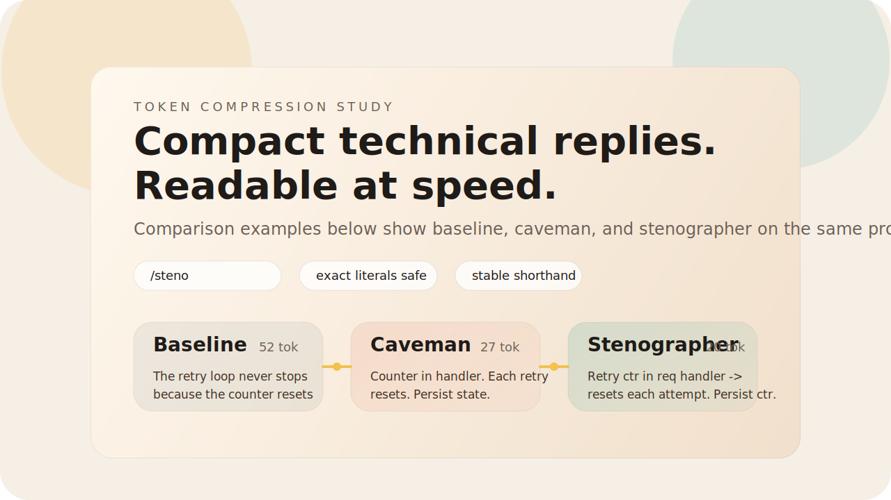

# Stenographer Mode



Shorthand-first token compression that stays readable, technical, and structurally precise.

Stenographer Mode is a prompt product for compact technical responses. It compresses through stable shorthand, preserved literals, and scan-friendly structure so the output stays useful in real engineering workflows.


## Why This Exists

- Technical answers often waste tokens on filler, framing, and repeated setup.
- Raw shortening can save tokens but damage scanability and precision.
- Stenographer mode is built to keep causality, identifiers, commands, and code-adjacent clarity intact while staying compact.

## Quick Comparison

Prompt: `Why does this API retry loop never stop?`

| Mode | Example | Tokens | Read on it |
| --- | --- | ---: | --- |
| Baseline | `The retry loop never stops because the retry counter is stored inside the request handler, so it resets to zero on every new attempt. Move the counter to state that survives across attempts.` | 52 | Clear, but long |
| Caveman | `Retry counter stored inside request handler. Each retry resets counter to zero. Terminal condition never hit. Move counter to state that survives retries.` | 27 | Fast, but rough |
| Stenographer | `Retry ctr lives inside req handler -> resets each attempt -> no terminal hit. Persist ctr across attempts.` | 20 | Compact and still technical |

Prompt: `Review this caching change.`

| Mode | Example |
| --- | --- |
| Baseline | `This change improves cache hit rate, but it also introduces a stale data risk because invalidation only occurs on create and not on update or delete.` |
| Caveman | `Cache hit rate better. Stale data risk. Invalidation only on create, not update/delete.` |
| Stenographer | `Hit rate up, but cache invalidation only covers create -> stale reads on update/delete paths.` |

Prompt: `Explain the architecture.`

| Mode | Example |
| --- | --- |
| Baseline | `The worker receives jobs from the API, enriches them with configuration from Redis, writes results to PostgreSQL, and emits metrics through OpenTelemetry.` |
| Caveman | `API sends jobs to worker. Worker reads Redis config, writes Postgres, emits telemetry.` |
| Stenographer | `API -> worker -> Redis cfg lookup -> Postgres write -> OpenTelemetry emit.` |

## What You Get

- VS Code Copilot prompt bundle for `/steno`
- comparison skill against caveman mode
- local demo page with token benchmark views
- install and export scripts for productized packaging
- starter packs for Claude, Cursor, and ChatGPT

## Demo

The local demo lives at `demo/index.html` and already has the right product feel for GitHub-adjacent sharing.

It includes:

- a branded landing hero
- baseline vs caveman vs stenographer examples
- exact benchmark metrics from `gpt-tokenizer`
- install, activate, and export flow
- product and release-kit framing

Important GitHub limitation: the interactive HTML demo cannot render inline inside a repository README. GitHub README pages can show images, SVGs, and links, but not an embedded local webpage.

That is why this README now uses a visual SVG hero at the top. If you want the actual interactive demo to be public from the repo, the next step is to publish `demo/` with GitHub Pages and link to that hosted URL.

## Install

One command, no clone required. The current one-liners pull straight from GitHub via `npx`.

| Target | Command |
| --- | --- |
| VS Code user prompts (global to your editor profile) | `npx --yes github:AkashAi7/stenographer-mode install --scope user` |
| Current repo only (`.github/prompts/`) | `npx --yes github:AkashAi7/stenographer-mode install --scope project` |
| Global CLI install | `npm install -g github:AkashAi7/stenographer-mode` |

If you install the CLI globally, use:

```powershell
steno-mode install --scope user
steno-mode install --scope project
```

If you already cloned or downloaded this repo, use the local scripts instead:

```powershell
npm install
npm run install:user
npm run install:project
```

Scopes:

- `user`: copies `bundles/vscode/steno.prompt.md` into the VS Code roaming prompt profile.
- `project`: copies the same prompt into `.github/prompts/steno.prompt.md` in the current working directory.

PowerShell wrappers still work on Windows and now delegate to the same Node installer:

```powershell
& '.\install\install.ps1'
```

Remove it:

```powershell
npm run uninstall:user
npm run uninstall:project
& '.\install\uninstall.ps1'
```

Primary command: `/steno`

Legacy alias: `/stenographer-mode`

## Exact Benchmarking

This project uses `gpt-tokenizer` for exact token counts.

Install dependencies:

```powershell
npm install
```

Generate benchmark artifacts:

```powershell
npm run benchmark
```

Outputs:

- `benchmarks/latest.json`
- `demo/benchmark-data.js`

## Export A Distribution Bundle

```powershell
& '.\install\export-pack.ps1'
```

This creates a timestamped bundle under `dist/` containing product metadata, prompt bundles, demo assets, benchmark artifacts, install scripts, and platform packs.

## Repo Structure

- `.github/skills/stenographer/SKILL.md`: VS Code Copilot skill
- `.github/skills/caveman/SKILL.md`: caveman comparison skill
- `bundles/vscode/steno.prompt.md`: VS Code user prompt bundle
- `demo/`: local landing page and README visual assets
- `packs/`: cross-platform starter packs
- `install/`: installer and exporter scripts
- `scripts/steno-mode.mjs`: cross-platform installer CLI
- `benchmarks/`: benchmark outputs
- `scripts/generate-benchmarks.mjs`: exact token generation pipeline

## Supported Surfaces

- VS Code Copilot Chat
- Claude
- Cursor
- ChatGPT

## Status

- install: ready
- export: ready
- demo: ready
- benchmark: exact

## Repository

- GitHub: `https://github.com/AkashAi7/stenographer-mode`
- Default branch: `main`
